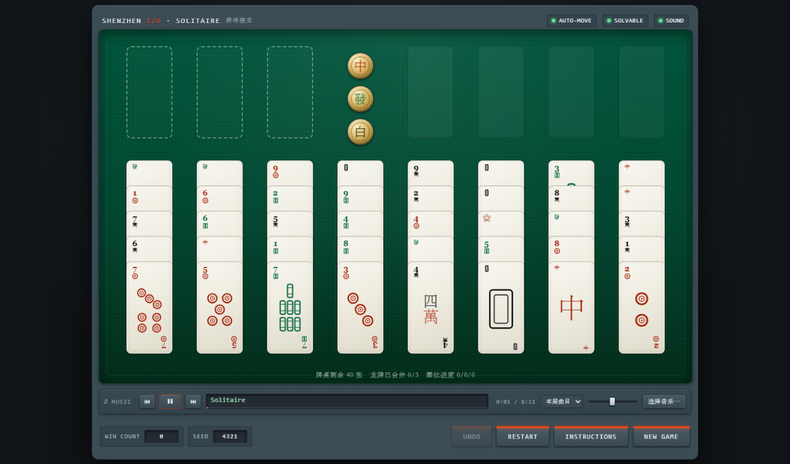

# SHENZHEN SOLITAIRE · 麻将接龙

复刻 **SHENZHEN I/O**（Zachtronics）里那个藏在游戏里的麻将牌接龙小游戏 —— 官方名字叫
**Shenzhen Solitaire**。规则、牌面、配色、牌桌布局都按原版还原。

> ### ▶ [**点这里在线试玩**](https://stcloudlake.github.io/shenzhen-solitaire/)
> GitHub Pages 托管，打开就能玩，不用下载任何东西。



## 怎么玩

| 方式 | 说明 |
| --- | --- |
| **网页版** | 下载 [`shenzhen-solitaire.html`](shenzhen-solitaire.html) 双击即可，单文件、零依赖、可离线 |
| **桌面版** | 到 [Releases](../../releases) 下载 `SHENZHEN-SOLITAIRE-*-win64.zip`，解压后运行 `SHENZHEN SOLITAIRE.exe` |
| **自己构建** | `.\build.ps1` 出网页版；`.\build-app.ps1` 出桌面版（需要 Node.js） |

> 本仓库**不包含**原版音乐与音效（那是 Zachtronics 的版权素材）。程序照常能玩，
> 音效会自动退回内置的合成音；想要原声就把你自己那份 SHENZHEN I/O 的
> `Content\music` 与 `Content\sounds` 放进程序目录，或按下一节的办法接上。

---

## 玩法（与原版一致）

**目标**：把 27 张数字牌按花色升序送进右上角的三个基位、把花牌 ❀ 送回花位、
把三组龙牌（中／發／白各 4 张）合并进左上角的三个空格。

| 牌桌 | 说明 |
| --- | --- |
| 40 张牌 | 筒／索／萬 三色各 1–9（27 张）+ 中／發／白龙各 4 张（12 张）+ 花牌 1 张 |
| 发牌 | 8 列 × 5 张，全部明牌 |
| 左上角 | 3 个空格，可临时放任意单张牌 |
| 右上角 | 花位 + 3 个基位（哪个花色先上 1 就占哪个格子） |
| 中上 | 3 个黄铜按钮，用来合并同色龙牌 |

**移动规则**

- 数字牌只能叠在「点数大 1 且花色不同」的牌上（`7筒` 上可放 `6索` / `6萬`）。
- 空列可以放任意一张牌或一整叠。
- 只有自上而下「点数依次减 1、花色交替」的连牌才能整叠拿走；单张顶牌随时可拿。
- 数字牌可以手动送上基位（同花色前一等级就位即可），上去后不可撤回。
- 龙牌不能叠任何牌、也不能被叠，只能进空格或空列。

**龙牌合并**：某一色 4 张龙牌全部露出（都在列顶或空格里）且存在可用空格时，
对应的黄铜按钮会发光；按下后 4 张一起收进该空格并**锁死**该格。

**自动上牌**：1 露出即自动飞上基位；点数更高的牌只有在**三个花色都上到前一等级**时
才会自动飞上去（例如三张 4 都就位后 5 才会自动走）。这样保证自动上牌永远走不死。
不满足安全条件但确实能上的牌可以自己拖上去（进阶操作）。

**操作**

- 拖拽：按住牌拖到目标位置松手。
- 点选：点一下牌选中（会高亮所有可落点），再点目标位置落牌，点空白处取消。
- 双击：把手动可以上基位的牌直接送上基位。
- 快捷键：`U`/`Ctrl+Z` 撤销 · `R` 重开本局 · `N` 新游戏 · `A` 自动上牌开关 · `M` 静音 · `I` 说明 · `Esc` 取消选中。

---

## 这个复刻里的额外东西

- **SEED**：每局都有种子，点一下复制带种子的链接，同一种子发到的牌局完全相同。
- **SOLVABLE 开关**（默认开）：发牌前跑一遍求解器挑一副可解的牌局。
  随机牌局约 **97%** 可解（实测 58/60，中位求解耗时 5ms），关掉就是纯随机、和原作一样。
- **UNDO / RESTART**：无限撤销、重开本局（保持同一副牌）。
- **背景音乐**：牌桌下方的音乐台直接播放本机 SHENZHEN I/O 原声，默认循环小游戏自己的
  那首 `Solitaire`（8:12），可切换「本局曲目 / 全部顺序 / 全部随机」、上一首/下一首、
  点击进度条快进、音量调节，状态会记住。详见下一节。
- WIN COUNT 存在浏览器本地，音效是 WebAudio 现场合成的（没有外部素材）。

---

## 关于音乐

音乐**不内嵌**在 HTML 里，也**不在本仓库和 Release 附件里**（原声 11 首共 109MB，
且版权属于 Zachtronics，不适合随代码分发）。做法是运行时用 `<audio>` 直接读本机文件：

- 构建时 `build.ps1` 扫描项目下的 `music/` 目录，把曲目清单和一份备用绝对路径写进 HTML。
- 本地开发时 `music/` 是一个**目录联接**，指向你的游戏安装目录：

  ```
  mklink /J music "F:\SteamLibrary\steamapps\common\SHENZHEN IO\Content\music"
  ```

  （`build.ps1` 会自动识别联接并记录真实路径作为备用。）
- 运行时优先用相对路径 `music/xxx.ogg`；读不到就退回构建时记录的绝对路径
  （所以把 HTML 单独拷到别处也还能响）。两条路都不通时，点音乐台右边的
  **选择音乐…** 直接挑文件夹即可（用 `webkitdirectory` 读取，换成自己的歌单也行）。
- 曲目：`Intro` `OS_Main` `Solitaire` `Solving 1–7` `Outro`。默认模式「本局曲目」会循环
  `Solitaire.ogg`，和原版在这个小游戏里放的是同一首。

音效同理：`sfx/` 里是原版 `Content\sounds` 的 11 个 wav（拿牌 / 放牌 / 发牌 / 按钮 /
合并 / 通关），缺文件就自动退回 WebAudio 合成音。`build-app.ps1` 会把它们复制进程序目录。

> 原声与音效版权归 Zachtronics 所有，这里只是读取你本机已购买的游戏文件，请勿连游戏一起分发。

---

## 桌面版（可直接执行的游戏程序）

除了网页版，还可以打包成真正的 Windows 程序，**音乐和音效都内置在程序目录里**：

```
.\build-app.ps1          # 首次会下载 Electron 运行时（约 150MB，之后走缓存）
```

产物：

```
dist\SHENZHEN SOLITAIRE\
  SHENZHEN SOLITAIRE.exe        ← 双击即玩，带图标与版本信息
  locales\                      只保留 en-US / zh-CN（省 47MB）
  resources\app\
    index.html                  游戏本体（与网页版同一份代码）
    main.js                     窗口外壳
    music\*.ogg                 11 首原声（真实文件，可随时替换）
    sfx\*.wav                   11 个原版音效（拿牌/放牌/发牌/按钮/合并/通关…）
```

- 整包约 **432 MB**：Electron 运行时 ~320MB + 原声 109MB。自带运行时，拷到任何
  64 位 Windows 上都能直接跑，不依赖浏览器或 .NET。
- 桌面版放开了自动播放限制，**开程序就有音乐**；网页版仍受浏览器策略限制，需先点一下画面。
- 窗口快捷键：`F11` 全屏、`Ctrl+Shift+I` 开发者工具、`Ctrl+Shift+Q` 退出；
  游戏内快捷键（`U/R/N/A/M/I/Esc`）不变。
- 想换音乐：直接替换 `resources\app\music\` 里的文件即可（清单在构建时写入，
  换名字请重新跑一次 `build.ps1`；或者用界面上的「选择音乐…」临时挑文件夹）。
- 音效是从游戏原版 `Content\sounds\` 里挑的 11 个：`card_pickup` `card_place`
  `card_deal` `card_sweep` `button` `os_beep_failure` `fanfare_solving1` 等；
  文件缺失时自动退回内置的 WebAudio 合成音。

---

---

## 目录结构

```
shenzhen-solitaire.html   ← 网页版：内联了全部 CSS/JS 的单文件游戏
build.ps1                 ← 把 src/ 打包成上面那个单文件
build-app.ps1             ← 打包桌面版：组装 app/ 并产出 dist\SHENZHEN SOLITAIRE\
app/                      桌面版外壳（package.json + main.js）
src/
  shell.html              页面骨架 + 中文说明文本
  styles.css              外观（配色取自原版截图）
  engine.js               规则引擎：发牌 / 合法性 / 自动上牌 / 龙牌合并 / 胜负 / 求解器
  art.js                  牌面美术（筒·索·萬·龙·花，全部 SVG 现画）
  music.js                背景音乐台（播放本机原声）
  sfx.js                  音效（播放原版 wav，缺文件退回合成音）
  ui.js                   布局、渲染、拖拽与点选、动画、音效、面板、控制台 API
music/                    目录联接 → 游戏安装目录的 Content\music
sfx/                      网页版用的音效副本（桌面版另有独立副本）
tools/pack/               打包用的 rcedit（写 exe 图标，构建时自动获取）
build/                    构建缓存（图标、Electron 运行时解压目录）
dist/                     桌面版产物
tests/
  engine.test.js          Node 单元测试（含 5000 局发牌不变量扫描 + 解算回放合法性校验）
  e2e.js                  无头 Edge + CDP 端到端测试（真实拖拽/点选/按钮，31 项）
  music.js                音乐模块测试（曲目清单、时长、播放推进、模式切换，19 项）
  app.js                  桌面版测试（启动真实 exe 验证音乐音效与持久化，25 项）
  shots.js                自动截图：开局 / 中局 / 残局 / 胜利
  diag.js                 拖拽事件诊断脚本
docs/                     预览截图
reference/                原版截图与第三方规则实现（仅用于比对，不参与构建）
```

## 开发 / 重新构建 / 测试

```powershell
.\build.ps1                      # src/ -> shenzhen-solitaire.html（网页版）
.\build-app.ps1                  # 打包桌面版到 dist\SHENZHEN SOLITAIRE\
.\build-app.ps1 -Refresh         # 强制重新复制音乐与音效

node tests/engine.test.js        # 规则引擎单测
node tests/e2e.js                # 浏览器端到端测试（需要 Edge）
node tests/music.js              # 音乐模块测试
node tests/app.js                # 桌面版测试（会启动打包好的 exe，窗口一闪即关）
node tests/app.js --shot         # 顺便截一张桌面版画面到 docs/
node tests/shots.js 24680        # 生成几张过程截图
```

浏览器控制台里还有个 `SZ` 对象可以玩：

```js
SZ.state()          // 当前局面
SZ.moves()          // 当前所有合法动作
SZ.solve()          // 跑求解器，返回一条解法
SZ.play(SZ.solve()) // 直接演示解法
SZ.newGame(12345)   // 指定种子开局
```

---

## 规则依据

原版规则靠三份材料交叉验证，避免凭印象写错：

- SHENZHEN I/O 中的小游戏本身（[LP Archive 第 8 期](https://lparchive.org/SHENZHEN-IO/Update%2008/) 有完整实机截图与规则描述）
- [zachtronics.com/solitaire-rules](https://zachtronics.com/solitaire-rules/) 官方规则截图
- 两个独立复刻实现：[puellanivis/szsol](https://github.com/puellanivis/szsol)（ncurses C 版）与
  [alexander-mcdowell 的网页版](https://alexander-mcdowell.github.io/projects/ShenzhenSolitaire/shenzhen.html)
  —— 整叠拿牌的合法性、自动上牌的安全规则都以此二者为准
- [hickford/shenzhen-solitaire-solver](https://github.com/hickford/shenzhen-solitaire-solver) 用于校准可解率

牌面配色取自原版截图：绒布绿 `#00553c → #022c1a`、机箱蓝灰 `#3c4c55`、警示橙 `#e14a20`、
牌面奶油色 `#f2f1e8`、墨色 `#a8260e`（红）/ `#0d6b47`（绿）/ `#161616`（黑）。

SHENZHEN I/O 与 Shenzhen Solitaire 是 Zachtronics 的作品；本项目是非商业性质的玩法复刻与学习用途。

## 版权与许可

- **代码**（规则引擎、界面、牌面美术、构建与测试脚本）：MIT，见 [LICENSE](LICENSE)。
- **不包含**：SHENZHEN I/O 的音乐、音效、图像等原版素材。它们版权归 Zachtronics 所有，
  仓库与 Release 附件里都没有；构建脚本只是读取你自己本机安装目录里的文件，
  请勿把那些素材二次分发。
- `reference/` 目录（原版截图与两个第三方复刻实现的源码，用于核对规则）已加入
  `.gitignore`，同样不入库。
- 这个项目与 Zachtronics 没有任何关系，也没有得到其授权或背书。
